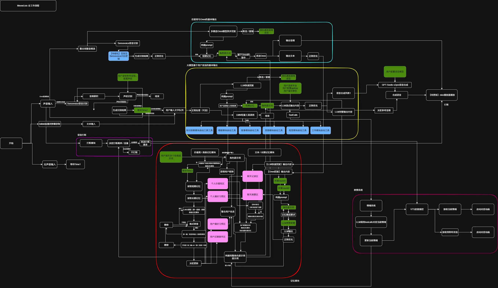

# Meowlisis!

[](LICENSE)

> 本项目采用 [MIT 许可证](LICENSE) 开源。

```
写代码的初衷是希望自己做动画的时候有个人陪我聊天
然后找不到人，就把一只小猫变成人了awa
更新频率随缘，可以在B站@YGZ醒脑片的直播间不定期看到
```

## 写在最前面
- 这里是Github的源代码区。
- 整合包地址：【百度网盘】链接: https://pan.baidu.com/s/1Ea-LSXFDMSUIN0o-9n4OBQ?pwd=0204 提取码: 0204 
--来自百度网盘超级会员v2的分享
- 超级感谢一下项目的开源，进行了些许参考：
- 整体框架逻辑给我了些许启发：https://github.com/worm128/AI-YinMei
- TTS的音色优化：https://github.com/High-Logic/Genie-TTS
- 最喜欢的猫娘项目，在记忆模块方面让我学到了很多：https://github.com/Project-N-E-K-O/N.E.K.O
- 针对TTS的合成加速，从这个项目第一次了解到GPU Graph的加速方法：https://github.com/chinokikiss/GSV-TTS-Lite

## 一些原创算法
```也可能不是原创，反正是自己瞎想瞎做的，有兴趣的可以看一下```
### 一、LLM水词的优化

```
对应模块：
func/llm/narration/
```

思路：LLM 回复"水"（全是套话废话）时自动压缩，回复内容丰富时完整保留语气词，让语音合成听起来不啰嗦、不干瘪。核心是「打分 → 分档 → 流式清洗」三层结构：

1. **水词库 → Trie 前缀树**：`adjunct_word.json` 可删除词（参与打分+删除）、`score_only_word.json` 只打分词（人设语气），构建 Trie，最长匹配优先，O(词长)。
2. **EWMA 平滑打分**（每轮用清洗前源文本）：
   - `Raw = max(0, density − penalty)`
   - `density = 100 − (W/L)×100`，当 `W/L ≥ density_threshold` 时 `density = 0`（W=水词总长度，L=文本长度）
   - `penalty = min(length_penalty_cap, max(0, L − length_threshold) × length_penalty_rate)`
   - `S = λ·S_prev + (1−λ)·Raw`，`λ = λ_down (Raw<S) / λ_up (Raw>S) / λ_equal (Raw=S)`
3. **三档流式清洗**（由 S 定档）：
   - `S ≥ part_level_upper` → 不删（FULL）
   - `part_level_lower ≤ S < part_level_upper` → 仅删类别 ∈ {2,3,5}（PART）
   - `S < part_level_lower` → 删全部可删词（ALL）
   - 逐字符 `feed`：Trie 最长匹配，可删词按档位丢弃，命中前缀则暂存；`flush()` 收尾。
4. **标点整理**：清洗后合并连续标点为句号、去掉句首残留标点、纯标点句不发送；再按标点切分为小句流式送入 TTS，保证断句自然。

相关配置：`config.yml → llm.narration`。

### 二、哼唱歌曲接龙触发

```
对应模块：
func/toolbox/meowsongs/hum_detect/hum_detect.py
func/toolbox/meowsongs/pass_the_baton
func/pipeline/toolbox_audio.py
```

思路：用户在角色唱歌时跟着哼一段，角色识别出是哪首歌、哼到哪了，然后**接着往下唱几句**（传花接龙），并播报感想、写入记忆。

1. **哼唱检测**：逐帧 RMS 能量，`rms ≥ energy_threshold` 视为有声并累积，静音 `≥ silence_threshold` 判定段结束；累积 `≥ hum_collect_sec(7s)` 立即判定。yin 提 F0（80–800Hz）→ MIDI 音高，判据：
   - 有调帧占比：`|valid|/|f0| ≥ f0_voiced_ratio`
   - 稳定帧占比：`mean(|Δmidi| < f0_stable_half_step) ≥ f0_stable_ratio`
   - 唯一音符数：`len(unique(round(midi))) ≥ f0_unique_notes`
2. **7 秒定歌（lock）**：哼唱与每首歌 vocal 音高缓存（npy）均去均值 `midi' = midi − mean(midi)`，滑动窗口余弦相似度 `score = max_i dot(w_i,q)/(‖w_i‖·‖q‖)`；`score ≥ match_threshold` 锁定 `{title, offset = best_idx×HOP/SR}`。
3. **段结束接唱（sing）**：LRC 时间轴定位，`user_lyric` = `[offset, offset+hum_duration]` 内歌词；从 `offset+hum_duration` 后第一句起取 `hum_lines` 句；播放 `vocal[start_sec : end_sec]`（end=下一句起始，无则至结尾）。
4. **记忆与感想**：用户哼的歌词与 AI 接唱的歌词写入短期/长期/用户记忆（type=hum_song）；接唱播完后由 toolbox LLM 按模板生成感想（含歌名与接唱歌词）播报；若没识别出来，LLM 会以角色身份自然地问一句"你刚刚是不是在唱歌"。

相关配置：`config.yml → meowsongs.pass_the_baton`。


## 接下来是一些功能介绍
<div align="center">

<figcaption>核心功能的流程图（未实时更新，待完善）</figcaption>
</div>

### 运行环境
```
WindowsOS 10/11
python 3.11.3
依赖库详见requirements
```

### LLM调用
LLM调用分为正常对话和工具调用
正常对话:
 - 支持Deepseek / Qwen / Gemini三家流式后端，默认deepseek（可开thinking）
 - 消息先正则清洗（易错词纠正），入队调度，拼短期记忆后流式输出
```
llm主要负责快速回复，基本仅使用flash级别的文本模型，即可胜任
```

工具调用:
 - set_emotion工具：每次回复强制调用，LLM输出情绪/强度/性格/是否触发价值观思考
 - 性格从角色卡动态读取，LLM按语境自行切换

提示词:
 - system_prompt自动组装：角色卡 + 价值观 + 日期（节日/节气）+ 记忆摘要 + 知识库检索
 - 角色卡绑定参考音频，情绪与音色联动
 - 弹幕走独立提示词，支持多用户与朗读前置
```
作者的话：
一个人的性格是复杂的，不是一份提示词能完全概括的，就算全写进一个提示词，普通的llm也无法很好的理解，所以做了这个动态性格提示词。
其次，这个项目没有考虑支持多ai智能体的互动！
但是吧......或许这个功能有很多其它玩法。
```


### 语音识别
基于SenseVoice魔改客户端（WebSocket连接本地服务，2pass流式识别，断线自动重连）
 - 多音频源独立会话：麦克风 / 扬声器采集(loopback) / 注入源，各源独立VAD、打断、声纹
 - 噪声过滤：VAD能量阈值，声音太轻不识别，可配置
 - 声纹检测：多声纹记录，相似度阈值匹配说话人，识别结果绑定用户
 - 数字归一化(itn)、热词、易错词替换规则
 - 实时打断：独立打断阈值，检测到说话即打断TTS
 - 断句合并(merge_delay)，流式上屏/合成
 - 扬声器采集(loopback)默认关闭，施工中。。。
Websocket音频传递：施工中。。。

### 语音合成
基于GPT-Sovits(v2pro)精简版，已内置，HTTP调用本地服务
 - 流式合成：按静音点智能切分（听感连贯）或定长切分（响应快），块间重叠衔接
 - 情绪驱动：LLM决策情绪标签+强度 → 情绪映射参考音频 + 每情绪独立采样参数（happy语速快、sad语速慢等）
 - 整段语言判定：中/英/日自动切换，中文最稳
 - 实时打断：SenseVoice检测到说话立即打断当前合成（pipeline模式，可配按键）
 - 多worker并发合成

### 视觉模块（MeowVision）
仅在线API（Qwen / Gemini 视觉模型）
 - 触发方式：LLM工具决策(use_vision)，或主动观看(watching)周期截图+画面变化检测
 - 截图 / 画面裁剪 / 变化检测：画面有变化才理解，窗口消失自动确认
 - 图片描述作为用户消息送入LLM，并写入短期/长期记忆

### 记忆模块
自研CatBrain多层记忆（func/catbrain），各层独立LLM后端（deepseek/aliyun/gemini）
 - 短期记忆：public_short_mem.json，按消息类型独立轮数裁剪
 - 长期记忆：按天落盘 character/memory/日期.txt，对话全量存档
 - 记忆摘要：缓存满50轮 → LLM概括为多事件（标签/话题/参与人/重要度/准确度）→ 去重 → 按月存 meow-YYMM.json
 - 摘要检索：按证据分>准确度>话题>标签相似度(jieba)>参与人>重要度取前20条进提示词；证据分带强化/质疑半衰期衰减，负分持续归档
 - 当前话题：LLM定期决策（60s缓存），参与摘要排序
 - 用户记忆：新用户LLM猜测建档，老用户每25轮分析更新（AI可判定无变化不改）
 - 价值观：独立LLM维护（高思考强度），12小时定时更新 + 哲思/对话触发，可选二次审查
 - 消息存档：全员记录 + 向量库（embedding+关键词检索）+ 站点检索

<details>
<summary>📁 .temp/public_short_mem.json · 短期记忆</summary>

```json
[
  { "role": "user", "content": "今天天气真好", "type": "llm_fast_response" },
  { "role": "assistant", "content": "是呀，喵~", "type": "llm_fast_response" }
]
```

按 type 独立轮数裁剪
</details>

<details>
<summary>📁 character/memory/2025-06-01.txt · 长期记忆</summary>

```json
[
  "[2025-06-01 12:00:00][用户名]: 内容",
  "[2025-06-01 12:00:03][喵利呜西斯]: 是呀，喵~"
]
```

每行一条，按天分文件
</details>

<details>
<summary>📁 character/abstract_memory/meow-2506.json · 记忆摘要</summary>

```json
[
  {
    "event": "用户说喜欢夏天",
    "tags": ["夏天", "爱好"],
    "topics": ["爱好"],
    "joint": ["用户"],
    "importance": 7,
    "accuracy": 5,
    "evidence": { "reinforcement": 0.5, "disputation": 0.0 }
  }
]
```

按月分文件，证据分带半衰期衰减
</details>

<details>
<summary>📁 character/info/users_info/用户名.json · 用户档案</summary>

```json
{
  "name": "用户名",
  "gender": "unknown",
  "character": "性格描述",
  "likes": "喜好",
  "preference": "偏好",
  "relation": "关系",
  "birthday": "生日",
  "affinity": 0
}
```

新用户猜测建档，老用户每25轮更新
</details>

<details>
<summary>📁 character/info/values/latest.json · 价值观</summary>

```json
{
  "0204": "主人的话",
  "trust": "信任",
  "belief": "信仰",
  "responsity": "责任",
  "honor": "尊重",
  "tolerance": "宽容"
}
```

0204 为"主人的话"，禁止修改
</details>


## 然后是类skills功能的介绍
```为什么说是类skills呢，一是up纯业余，对于MCPskill的概念界定不是很清楚，二是每个功能都是和我加小猫和个人需求强绑定的，几乎没有通用性(不过在实现方法上应该有参考价值，大概)```
施工中。。。
## Vtuber皮套
通过 VTube Studio 的 WebSocket 接口驱动 Live2D 皮套，支持情绪→表情映射、身体摆动与口型同步，对应 func/vts 模块。

## Bilibili直播api兼容
接入 B 站开放平台弹幕协议（blivedm），支持弹幕读取、主动发弹幕、礼物感谢与 SC 回复，可在配置界面扫码登录。

## 点歌
MeowSinger 点歌模块，通过关键词或前缀触发，调用网易云音乐搜索并播放歌曲，支持歌词同步字幕。

## 翻唱
基于 RVC 的翻唱模块，支持指定模型与特征索引进行翻唱，对应 .RVC 服务。

## 每日提醒
待办提醒模块，读取 character/backlog 下的待办事项，按设定时刻主动提醒，支持直播端与 QQ 双通道。

## 节日祝福
节日/生日/节气祝福模块，按公历、农历、24 节气与浮动节日自动生成祝福文案。

## 主动聊天
空闲主动回复核心，支持冷却计时、原创话题与继承话题，让角色在无人互动时主动开口。

## 记忆整理
抽象记忆、用户记忆与长期记忆等多层记忆协同，定时摘要与整理，持续优化中。

## 网页浏览
主动浏览 B 站内容，自动截帧、筛选话题并生成摘要，支持缓存与收藏。

## 视频理解
MeowVision 视觉模块，支持屏幕截图、画面裁剪与变化检测，调用多模态模型理解画面。

## 手机操控
施工中，暂无实现。

## 绘画
施工中，暂无实现。

## 讲故事
施工中，暂无实现。

## 文件读取
文本读取模块（func/catbrain/txt_reader），支持文件列表、切分、关键词定位与分词。

## 知识库
数据库/RAG 知识库，支持爬取指定站点、向量检索与关键词匹配，可将内容学习入库。

## Minecraft日志读取
施工中。
```
完全没有做玩MC的适配，等世界模型吧，现在模型玩游戏真不能看
```

## To do list
1、给不同的提示词配置对应的参考音频
2、补全施工内容
3、napcat适配

## Requirements
依赖清单见 requirements.txt，运行环境为 Python 3.11（项目内置 runtime 目录）。

## Star History

<a href="https://www.star-history.com/#YGZxingnaoP/.Meowlisis&Date">
  <picture>
    <source media="(prefers-color-scheme: dark)" srcset="https://api.star-history.com/chart?repos=YGZxingnaoP/.Meowlisis&type=Date&theme=dark&legend=top-left" />
    <source media="(prefers-color-scheme: light)" srcset="https://api.star-history.com/chart?repos=YGZxingnaoP/.Meowlisis&type=Date&legend=top-left" />
    
  </picture>
</a>